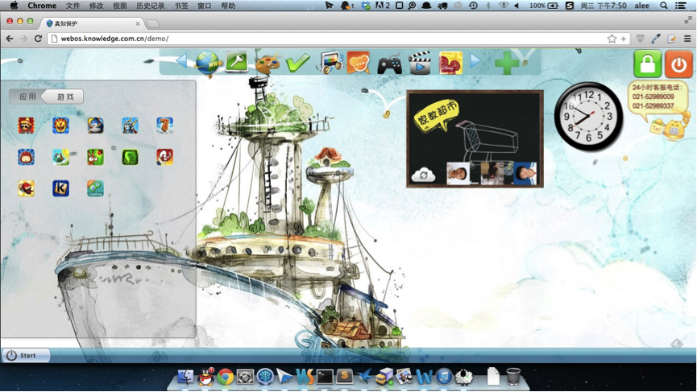
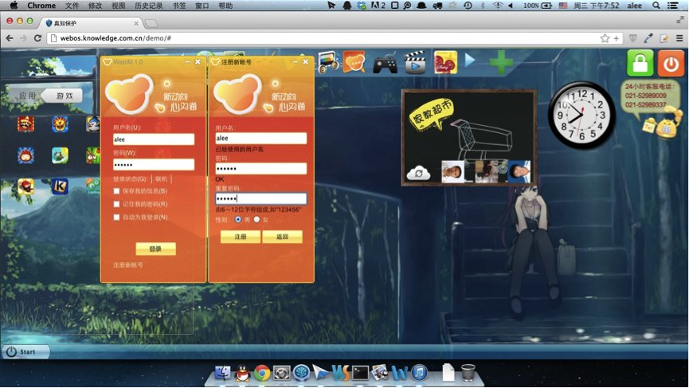
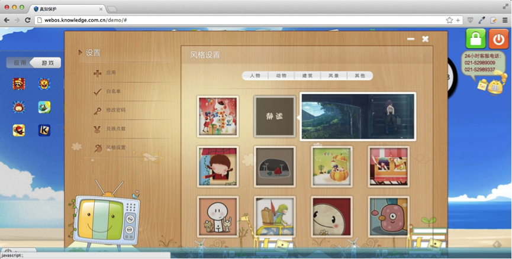
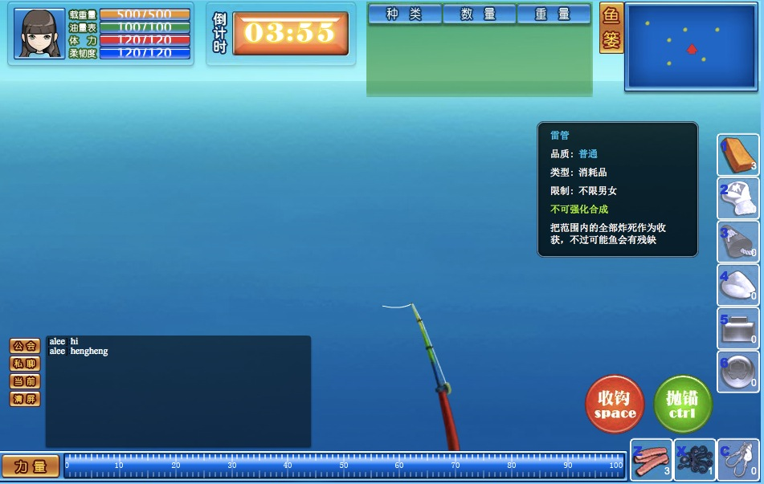

___周谦___（1982-10-11——），祖籍湖北宜昌。

教育：苏州科技学院，汉语言文学专业（肄业）。

从2003年至今一直从事编程工作。

Weibo: http://weibo.com/aleechou

GitHub: https://github.com/aleechou

QQ: 76520007

Email: aleechou@gmail.com

---

# 专业能力

## Web开发

___Platform & Server：___

* 熟悉 Linux/BSD 平台多种发型版本，包括 Ubuntu, CentOS, FreeBSD, MacOSX。

	从2007年至今，一直使用 Ubuntu/MacOSX 作为日常操作系统（台式电脑和笔记本使用Ubuntu, 随身MacbookAir使用MacOSX）。仅仅因为Windows桌面开发需要，以及 WOW 才进入Windows。Windows是一个伟大的操作系统，但是我喜欢 Unix Like 。

* 熟悉 Apache/Nginx/Tomcat 等Web Server架构。

___Database___

* 熟悉数据库SQL语言及其范式，熟悉MySQL Server的优化、事务、负载架构等工作。

* 熟悉 Memcache 和 MongoDB 等 NoSQL 数据库

___Programe Language___

* 精通 PHP，了解PHP几乎所有的语法特性，常用的函数库，以及PHP的源代码。经常使用C++/C 为PHP编写原生模块。长期维护一款开源的OOP/AOP PHP框架。

* 精通 Node.js 开发，在 Github 有许多我的 Node.js 项目，包括 Web框架，模板引擎，以及各种工具库。

* 熟悉 Java SE 和 JSP ，曾用 Java 6 SE 开发过网页游戏客户端。

* 精通前端 Html4/5 JavaScript 。

* 精通虽然没有前途，但眼下尚保有余热的 Flash ActionScript 1.0 和 3.0。

## 桌面开发

* 熟悉 VC/Windows API 开发（对VC的使用仅限 MFC，没做过.NET开发）。

* 熟悉 Qt4/5 针对 Windows/MacOSX/Linux 上的跨平台开发。

* 熟悉在 Windows 使用 ActiveX 开发IE插件。

## 移动设备

* 了解 ObjectiveC/C++ 在 iOS 上的开发，只做过电子书等小型程序。

* 了解 Java/C++ 在 Andriod 上的开发，但缺少实际项目经验。

## 其他非工作需要的技术

* 熟悉 Lua，曾为 WOW 写插件

* Python，曾用来写过一些小型程序，例如 自动通知 VeryCD 更新的 MSN 机器人。

* Bash Shell，不喜欢，但是常常需要用。

## 项目管理和领导团队

* 深入理解 GoF 设计模式，能自觉地在所有语言中遵循模式和原则，保证系统“拥抱重构”，以及痛恨系统中任何形式的“重复”的存在。

* 懂得主动违反设计模式， 以避免“设计过度”。

* 熟练实施敏捷开发中的很多实践方式，例如：测试先行，测试驱动，持续继承，统一过程(迭代增长)。
	
	（但执行的完整程度，则取决于语言。目前为止，能够完整实践敏捷开发的语言只有Node.js）

* 擅长分享技术和处理团队中的技术难题，喜欢沟通、项目规划、系统设计，和系统架构等工作，有丰富的技术团队 Leader 经验。

## .ignore (婉拒以下技术工作)

* .NET

	(由于.NET和Java SE极为相似，但.NET仅针对Windows平台提供官方支持，因此不打算采用.NET技术，也婉拒.NET相关的工作)

---

# 主要项目

## 蜂巢(OpenComb)

项目主页：[http://www.opencomb.com](http://www.opencomb.com)

“蜂巢”是一个基于 PHP5.3 实现的深度云计算应用框架。

蜂巢采用了扩展模式，系统中的功能和特性都由扩展提供。

我和我在大连的团队为蜂巢陆续实现了以下“开箱即用"的扩展：

* CMS(内容管理系统)扩展

* 菜单编辑器扩展 - 可以对系统中所有的导航菜单编辑管理

* 语言翻译扩展 - 可以设置语言，并翻译网页中所有出现的文字内容

* OA扩展 - 实现了常用的OA(办公自动化)功能

* OAuth扩展 - 允许用户使用微博,腾讯,人人等多个社交网站的账号登陆，并推送消息到这些社交网站

* 视图编辑扩展 - 该扩展实现了以下高级功能：
	
	* 所有的网页上的视图(view)布局，都过已通过拖拽方式，进行所见即所得的编辑，并保存
	
	* 能够“合并“网页中的视图，生成新网页
	
	* “编织”模板 —— 不是修改模板的源文件，而是将html内容编织到模板的特定位置

* Banner管理

* … …

所有蜂巢的扩展，都是可选安装的，蜂巢框架本身并不提供具体的功能。

## 蜂巢 Node.js 版本

Github主页：[https://github.com/OpenComb/OpenComb](https://github.com/OpenComb/OpenComb)

从 2012 年低，我停止了 OpenComb 的PHP版本，转移到 Node.js 下。

并且将 蜂巢 for Node.js 中的一些核心子系统，分离成为独立的项目发布

* __ocSteps__ 是一个JavaScript异步执行辅助工具，它解决了 Node.js 异步模式所带来的“麻烦”（许多程序员称其为：“回调地狱”）。

	不同于流行的 [async](https://github.com/caolan/async) 和 [Step](https://github.com/creationix/step) ，ocSteps 更擅长动态地“演进”任务链，而不仅仅是静态地定义任务链结构。这更吻合我们在思考业务逻辑时的思路，能让开发编码更加流畅，并且明显减少编码工作。___ ocSteps 是为复杂、动态的任务链而设计。___
	
	Github: [https://github.com/OpenComb/ocSteps]()
	
	我为 ocSteps 准备了100%覆盖率的测试用例，并基于这些测试用例部署了持续集成工具：

* ___ocTemplate___ 一个 Node.js 模板引擎。

	Github: [https://github.com/OpenComb/ocTemplate]()

	ocTemplate 的特点是在渲染前支持 jQuery 操作（在服务器后端使用jQuery，而不是前端浏览器里），这个特性主要针对 插件 机制：可以在插件里，使用 jQuery 来修改网页模板，这样一来，对模板的修改，就可以随着插件打包发布了；还能够避免直接修改模板源代码，影响未来的升级和维护。

## NodeIM

NodeIM 是一个完全由 JavaScript 实现的即时通讯项目，它包含了完整的服务器端和客户端代码。

* 客户端由Html5（在Qt/WebKit里）实现。

* 服务器端仅仅使用了 Node.js 和 MongoDB。

Github: [https://github.com/aleechou/nodeim]()

## 窝内网

[http://www.wonei.com](http://www.wonei.com)

窝内网是一个面向魔兽世界玩家的SNS网站，它早期在网游玩家中拥有广泛的知名度。

窝内网最早基于UCHome 1.5 ，在运营过程中，我们陆续加入了大量的自有代码库。

## 窝特(Wote)

“窝特”是为窝内网开发的桌面软件，谐音“What?”，用来推送窝内网用户的社交动态，类似“人人桌面”。

是我在项目之间的空闲期里，在公司内发起的项目，组织了其他的同事一起完成这个项目，包括程序员、美工，和网站编辑。

客户端使用 Qt ，服务器端使用 Java 。

## 窝Q

窝Q是一个窝内网专用的腾讯QQ机器人，窝内网的用户可以在QQ上将窝Q加为自己的好友，然后通过和窝Q聊天实现和网站的互动。

窝Q实现了一下功能：

___普通好友聊天___

* 基本的SNS社交命令 - 发心情碎语，日志，分享，以及评论好友的内容

* 接收好友的动态

* 能够用来查询魔兽世界的数据库(物品，装备，副本等信息)

* 查询魔兽世界的玩家状态（等级，装备，成就信息等）

* 能够调戏、拍打、喂食 …… ，以及反射吐槽 （拥有用户定义的语言库）

___QQ群聊天___

* 所有单独普通好友聊天的功能

* 能够教窝Q回答 （这是在QQ群里面最受欢迎的功能，用户教窝Q机器人吐槽其他用户，从此乐此不疲）

* 魔兽公会功能，例如查询玩家在公会里的 DKP 积分等。

窝Q使用了当时我拿到的开源项目，QQ协议v2009的 C 语言实现版本，后来腾讯终止了这个版本的协议，而我忙于其他项目，一直没有时间升级，所以窝Q机器人离线至今。

窝Q虽然已经下线了，但用户对窝Q的喜爱在社区里记录了下来： [http://www.wonei.com/w_search.php?k=%E7%AA%9DQ&ac=blog&do=1&sid=&searchsubmit=1](http://www.wonei.com/w_search.php?k=%E7%AA%9DQ&ac=blog&do=1&sid=&searchsubmit=1)

___窝Q代码的其他用途___

窝Q上线后，我以开源协议发布了其源代码，到现在仍有很多用户根据Readme里的联系方式找到我，要求后续维护。

后来在朋友的介绍下，我帮助国内知名社区[落伍者论坛](http://www.im286.com)，使用窝Q的核心代码实现了论坛用户的QQ账号自动认证。

## 京东(jd.com)数字音乐商城MP3/MP4播放器

[http://music.jd.com] (http://music.jd.com)

参与了京东数字音乐商城项目，所有类型的播放器（MP3播放器，MV视频播放器，试听播放器，付费后的单曲播放器，专辑播放器，以及电台播放器）的开发小组由我负责。

## 房市網

房市網，[http://www.funce.com](http://www.funce.com)，开发时间大约于 2005 到 2008年，是一个在台湾地区运营的房地产交易网站（类似于搜房网）。

房市網是我早期的工作，由我独立地完成整个网站的开发，使用 PHP4 ，MySQL4 。

## “两者”


"两者"是一家男鞋品牌商城网站

该网站使用Node.js框架 蜂巢 开发，其CSS采用了“响应式布局”，能够自动适应移动设备，完全符合现代互联网标准（web 2.0/3.0）。

按照客户的要求，该网站计划于今年秋季上线。



## 真知保护

[http://www.knowledge.com.cn](http://www.knowledge.com.cn)

真知保护是一个客户委托的开发项目，它是一款儿童保护软件，安装到计算机以后，会锁定windows桌面，儿童用户只能访问我们提供的桌面，从而限制和过滤儿童对计算机和互联网的访问。

在真知保护提供的桌面上，我们实现了：浏览器，聊天(及时通讯)，视频，音乐，文件架等常用的系统功能。真知保护和后来的QQ桌面很像。

在这个项目中，我负责实现系统的设计/架构，核心代码的开发，组建和管理团队，并负责和客户进行需求的沟通，以及合作单位的技术对接（该项目是和浙江电信互联星空联合运营的）。

为这个项目，我组织了大约 12名程序员和美工，在开发上花费了6个月的时间。

## 

## I,Cell

《我，细胞》是一个以微生物环境为故事背景的 物理解密+塔防 类型游戏。

玩家会在游戏中扮演显微镜下的一个单细胞生物。你可以控制细胞的移动探索微观世界，搜集氨基酸，躲避或迎击病毒群。

当玩家滚动鼠标滚轮时（或触摸屏幕上的手势），显微镜的观察倍数就会放大，细胞的体内场景逐渐显示出来。你必须在为细胞建造各种器官来提升细胞的能力，以及防御进入到细胞得病毒。

细胞的体内场景就是一个经典的自由布局塔防。

击杀每一关的Boss后，细胞会随机生长，因此你无法完全控制细胞的自然形状。完美击杀Boss会获得DNA奖励，用以细胞的生长和器官的解锁、升级。

《我，细胞》还提供了一个功能完善的关卡编辑器，由玩家来自由编辑关卡。

Github: [https://github.com/JeCat/games-icell] (https://github.com/JeCat/games-icell)

Demo：[http://games.jecat.cn/icell] (http://games.jecat.cn/icell)

## 钓钓堂

《钓钓堂》是一款钓鱼题材的页游，在游戏中玩家组队进入渔场（房间），每个房间分为两队，每队4名玩家。玩家需要驾驶游艇，寻找鱼群，钓鱼或使用道具干扰其他玩家钓鱼。游戏结束后，按照团队计算成绩。

* Server: Java 6 SE

* Client: Flash Action Script 3

